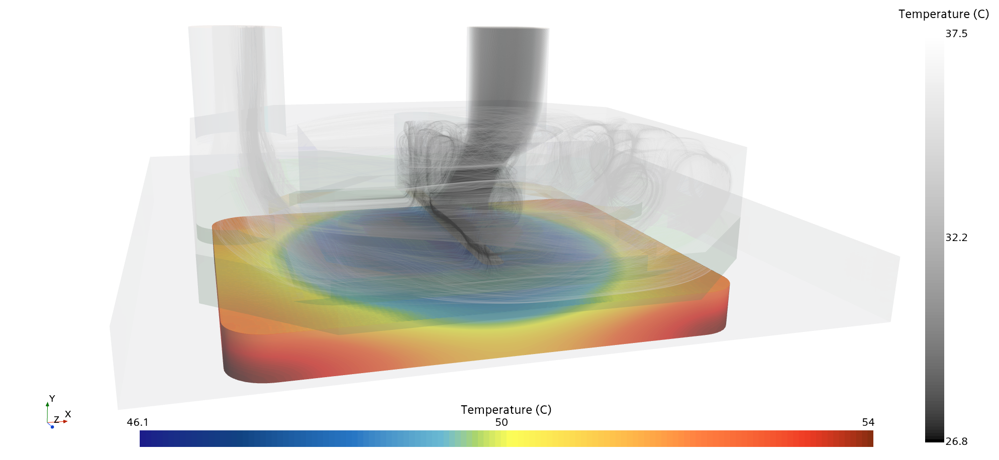

# LGA1700-Water-Block-1D-Thermal-Model
1D thermal resistance network for CPU cold plate optimization, calibrated against CFD simulations. Enables rapid parametric design studies to identify thermal bottlenecks and evaluate design modifications without re-running expensive 3D CFD (see my other repo: [LGA1700-Water-Block-CFD-Simulation](https://github.com/Ultravis66/LGA1700-Water-Block-CFD-Simulation))

A two-zone thermal resistance network model for CPU cold plate analysis, calibrated against high-fidelity CFD simulations. This tool enables rapid parametric design optimization without the computational cost of re-running 3D CFD.


*Temperature distribution from CFD*

## Overview

This project demonstrates a typical thermal engineering workflow:
1. **3D CFD** provides high-fidelity physics and calibration data
2. **1D resistance network** enables instant parametric studies and bottleneck identification
3. **Design optimization** through rapid "what-if" scenarios

The model accurately predicts CPU temperature, outlet temperature, and heat distribution for a jet-impingement cold plate with porous fin arrays.

## Key Features

- **CFD-Calibrated**: Validated against [LGA1700-Water-Block-CFD-Simulation](https://github.com/ultravis66/LGA1700-Water-Block-CFD-Simulation)
- **Fast Parametric Studies**: Instant evaluation of design changes
- **Thermal Bottleneck Identification**: Quantifies resistance contributions
- **Design Optimization Scenarios**: Pre-configured "what-if" studies

## Model Architecture

Two-Zone Thermal Resistance Model
---------------------------------

        [ CPU ]
           │
    ( R_contact )
           │
        [ Plate ]
           │
      ┌────┴────┐
      │         │
 R_path,1   R_path,2
      │         │
 [ Fluid 1 ] [ Fluid 2 ]
    (Tb1)       (Tb2 = Tout)

Fluid heating: Tin → Tb1 → Tb2
Heat split: Q1 → Fluid 1, Q2 → Fluid 2


**Physics Captured:**
- Contact resistance (CPU ↔ cold plate interface)
- Conduction through copper plate
- Convective heat transfer to coolant (water)
- Cumulative fluid heating through zones

## Results

### Baseline Performance (CFD-Validated)
- **CPU Temperature**: 73.2°C (346.3 K)
- **Outlet Temperature**: 32.8°C (305.98 K)
- **Heat Load**: 250 W
- **Mass Flow Rate**: 0.01 kg/s

### Thermal Resistance Breakdown
| Component | Resistance (K/W) | % of Total |
|-----------|------------------|------------|
| **Contact Resistance (CPU ↔ Plate)** | 0.1414 | **76.3%** ← Primary bottleneck |
| **Thermal Paths (Plate ↔ Fluid)** | 0.0438 | **23.7%** |
| - Parallel combination | 0.0208 | - |
| -- Porous zone path | 0.0217 | - |
| -- Outlet zone path | 0.4982 | - |
| **Total System Resistance** | **0.1852** | **100%** 

### Key Finding
**Contact resistance dominates thermal performance.** Improving the CPU-to-cold plate interface has 10× greater impact than adding fins or increasing flow rate.

## Parametric Sensitivity

### Contact Resistance (TIM Quality)
| R_contact | CPU Temp | ΔT from baseline |
|-----------|----------|------------------|
| 0.01 K/W (excellent TIM) | 40.3°C | **-32.9°C** |
| 0.05 K/W (good TIM) | 50.3°C | **-22.9°C** |
| 0.14 K/W (baseline) | 73.2°C | 0°C |
| 0.30 K/W (poor TIM) | 112.8°C | +39.7°C |

### Mass Flow Rate
| Flow Rate | CPU Temp | ΔT |
|-----------|----------|-----|
| 0.005 kg/s (half) | 78.9°C | +5.8°C |
| 0.01 kg/s (baseline) | 73.2°C | 0°C |
| 0.02 kg/s (double) | 70.3°C | -2.9°C |

### Fin Area
| Area Multiplier | CPU Temp | ΔT |
|-----------------|----------|-----|
| 0.5× (half fins) | 77.8°C | +4.6°C |
| 1.0× (baseline) | 73.2°C | 0°C |
| 5.0× (5× fins) | 69.2°C | -4.0°C |
| 10.0× (10× fins) | 68.7°C | -4.5°C |

## Design Optimization Scenarios

| Scenario | Modifications | CPU Temp | Reduction |
|----------|--------------|----------|-----------|
| **Baseline** | - | 73.2°C | - |
| **Improved TIM** | R_contact = 0.05 K/W | 50.3°C | **-22.9°C** |
| **Higher Flow** | 2× mass flow | 70.3°C | -2.9°C |
| **More Fins** | 5× fin area | 69.2°C | -4.0°C |
| **COMBINED** | All improvements | **44.1°C** | **-29.1°C** |

## Installation
```bash
# Clone repository
git clone https://github.com/ultravis66/LGA1700-Water-Block-1D-Thermal-Model.git
cd LGA1700-Water-Block-1D-Thermal-Model

# Install dependencies
pip install -r requirements.txt

# Run analysis
python coldplate_thermal_analysis.py
```

**Requirements:**
- Python 3.7+
- NumPy
- SciPy

## Usage

### Basic Usage
Run the complete parametric study:
```bash
python coldplate_thermal_analysis.py
```

### Custom Analysis
```python
from coldplate_thermal_analysis import ThermalParams, coldplate_2zone_model

# Define your parameters
params = ThermalParams(
    Q_total=250.0,       # Heat load [W]
    mdot=0.01,           # Mass flow rate [kg/s]
    Tin=300.0,           # Inlet temperature [K]
    R_contact=0.05,      # Contact resistance [K/W] - improved TIM
    # ... other parameters
)

# Run model
result = coldplate_2zone_model(params)
print(f"CPU Temperature: {result.Tcpu:.2f} K")
```

## Calibration Methodology

The effective heat transfer coefficients were calibrated to match CFD results:

1. **CFD Simulation**
   - 3D conjugate heat transfer
   - Porous media model for fin array
   - Validation: CPU temp = 346.3 K

2. **1D Model Calibration**:
   - Minimize residuals: (T_cpu^1D - T_cpu^CFD)² + (Q_porous^1D - Q_porous^CFD)²
   - Calibrated h_porous = 1.18×10⁶ W/m²-K (effective)
   - Calibrated h_outlet = 6.99×10³ W/m²-K

3. **Validation**:
   - CPU temperature error: 0.0 K
   - Outlet temperature error: 0.1 K
   - Energy balance: 250.0 W (exact)

**Note**: The calibrated h-values are *effective* parameters that lump complex porous medium physics (volumetric heat transfer, turbulent mixing, fin effects) into simplified convective coefficients.

## Engineering Insights

### Why Contact Resistance Dominates
With 76.3% of total thermal resistance, the CPU-to-cold plate interface is the primary bottleneck. This occurs because:
- Limited metal-to-metal contact (surface roughness)
- Thermal interface material (TIM) has lower conductivity than copper
- Interface area is fixed by CPU dimensions

### Diminishing Returns on Fins/Flow
The porous zone already has excellent heat transfer (R = 0.0217 K/W). Further improvements yield minimal benefit because:
- Heat must first cross the contact resistance bottleneck
- Additional fins can't access heat trapped at the interface
- Classic series resistance limitation: R_total ≈ R_largest

### Practical Design Recommendations
1. **Priority 1**: Optimize TIM selection and application
2. **Priority 2**: Maximize contact pressure (within CPU limits)
3. **Priority 3**: Consider flow rate increase (modest benefit, low cost)

## Model Validation

The 1D model was validated against additional CFD simulations with varying contact resistance to confirm predictive capability beyond the calibration point.

### Validation Results

| Case | R_contact (K/W) | CPU Temp - CFD (°C) | CPU Temp - 1D (°C) | Error (°C) |
|------|----------------|---------------------|-------------------|-----------|
| **Improved TIM** | 0.059 | 50.7 | 50.3 | **0.4** |
| **Baseline** | 0.148 | 73.2 | 73.2 | **0.0** |

| Case          | mdot (kg/s) | CPU Temp - CFD (°C) | CPU Temp - 1D (°C) | Error (°C) | ΔT_coolant CFD (°C) | ΔT_coolant 1D (°C) |
| ------------- | ----------- | ------------------- | ------------------ | ---------- | ------------------- | ------------------ |
| **High Flow** | **0.04**    | **69.53**           | **68.85**          | **0.68**   | **1.47**            | **1.49**           |




**Key Findings:**
- Model accurately predicts temperature across a 2.5× range in contact resistance
- Maximum error: 0.4°C (0.5% of temperature rise)
- Validates use of calibrated effective h-values for parametric design studies

This demonstrates the model is **predictive**, not merely curve-fit to a single operating point. The 1D approach is suitable for rapid design trade studies when exploring TIM selection, fin geometry, or flow rate modifications.


## Related Projects

- [LGA1700-Water-Block-CFD-Simulation](https://github.com/ultravis66/LGA1700-Water-Block-CFD-Simulation) - High-fidelity 3D CFD validation

## Technical Background

This model demonstrates a common thermal engineering workflow where:
- **CFD provides truth data** but is computationally expensive (hours per run)
- **1D models enable rapid iteration** (milliseconds per run)
- **Calibration bridges the gap** between fidelity and speed
  
## Author
if you use this work, please cite:
```
@misc{coldplate1d2025,
  author = {Stolk, Mitchell},
  title = {LGA1700 Water Block 1D Thermal Model},
  {2025},
  publisher = {GitHub},
  url = {https://github.com/ultravis66/LGA1700-Water-Block-1D-Thermal-Model}
}

